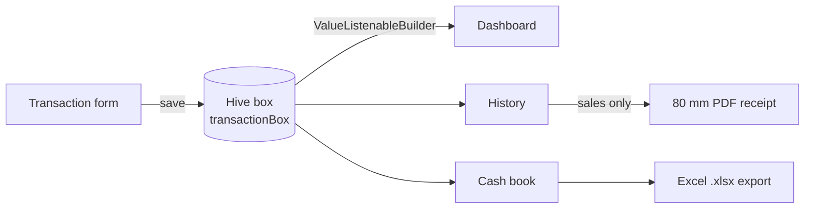

# Fishery Supply Chain

**Offline-first bookkeeping app for a fish and shrimp trading business.**
Built for a real small business owner who records purchases and sales at the pond and the market, often without a reliable mobile signal.

<!-- Drag fishery_overview.mp4 onto this line in the GitHub editor to embed the overview video -->


-F2994A)


---

## The problem

The owner tracked stock and money in paper notebooks. That made three things hard:

- **Knowing current stock** per species without recounting every page.
- **Reconciling cash** across many small purchases and sales.
- **Giving buyers a proper receipt** and handing a clean report to whoever does the books.

Cloud apps were not an option: connectivity at the ponds is unreliable, and the business needs one phone, one owner, and zero running costs.

## What the app does

| Screen | What it shows |
|---|---|
| **Login** | Single-owner login before any data is shown. |
| **Dashboard (Beranda)** | Net balance (sales minus purchases), total kg in and out, current stock per item, and the three most recent transactions. |
| **New transaction** | Record a purchase/harvest (*Masuk*) or a sale (*Keluar*): category, item name, weight in kg, and amount in Rupiah. |
| **History (Riwayat)** | Every transaction, newest first. Sales get a **print receipt** button. |
| **Cash book (Laporan)** | Date-sorted ledger with money in, money out, and a running balance, plus **one-tap Excel export**. |

Supported categories: fish (*Jenis Ikan*), shrimp (*Jenis Udang*), molluscs (*Jenis Molusca*), and shellfish (*Jenis Kerang*). The interface is in Indonesian, matching the owner's daily language.

## How it works



All data lives in a single local Hive box on the device. Every screen listens to that box, so the dashboard, history, and cash book redraw the moment a transaction is saved. There is no server, no account, and no internet requirement.

### Derived metrics

Nothing is stored twice. Every figure is recomputed from the raw transactions:

| Metric | Calculation |
|---|---|
| Net balance | Σ sales amount − Σ purchase amount |
| Stock per item | Σ kg bought − Σ kg sold, shown only while above zero |
| Volume | Total kg in and total kg out |
| Running balance | Cumulative (money in − money out), ordered by date |

### Data model

Each transaction (`lib/transaction_model.dart`) stores:

| Field | Example |
|---|---|
| `id` | UUID v4 |
| `type` | `Masuk` (purchase/harvest) or `Keluar` (sale) |
| `category` | `Jenis Udang` |
| `itemName` | `Udang Vaname` |
| `weight` | `15` (kg) |
| `price` | `2700000` (total amount, Rp) |
| `date` | ISO-8601 timestamp |

### Outputs

- **Thermal receipt:** generated with `pdf` + `printing` on `PdfPageFormat.roll80`, the standard 80 mm paper used by common Bluetooth thermal printers. The system print dialog shows a preview before printing.
- **Excel cash book:** generated with `excel` and saved with `file_saver` as `Laporan_Kas_Fishery_<timestamp>.xlsx`, with a styled header, borders, and sized columns, ready for an accountant.

## Tech stack

| Layer | Choice | Why |
|---|---|---|
| UI | Flutter, Material 3 | One codebase, runs well on low-end Android phones |
| Storage | Hive | Fast, file-based, works fully offline |
| IDs | `uuid` | Collision-free keys, ready for future syncing |
| Reports | `excel`, `file_saver` | Native .xlsx output the owner can open anywhere |
| Receipts | `pdf`, `printing` | 80 mm thermal layout with print preview |

## Project structure

```
lib/
├── main.dart                  # App, login, dashboard, history, cash book, transaction form
├── transaction_model.dart     # Transaction model used by the app (Hive)
├── injection.dart             # Service locator setup (roadmap)
├── domain/
│   └── app_models.dart        # Vessel and catch models (roadmap)
└── data/
    ├── local/
    │   └── database_helper.dart       # SQLite schema (roadmap)
    └── repositories/
        └── local_repository.dart      # Sync-aware repository (roadmap)
```

## Getting started

Requirements: Flutter SDK (Dart 3) and an Android device or emulator.

```bash
flutter pub get
flutter run
```

To build an installable APK:

```bash
flutter build apk --release
```

## Roadmap

These pieces are designed and partly written, but **not yet wired into the running app**:

- **Relational schema:** SQLite tables for vessels, catches, and transactions with foreign keys (`lib/data/local/database_helper.dart`).
- **Sync-ready records:** UUID primary keys and an `is_synced` flag on every row, so records can be uploaded safely and marked once confirmed.
- **Cloud backup:** Firestore (dependency already added) for multi-device access and backup.
- **Stock guard:** block a sale that exceeds available stock.

## Known limitations

- **Single owner by design.** Login credentials are configured in code for one owner on one device. Replace them before sharing the source or installing for anyone else.
- **Sales are not checked against stock.** Selling more than is available is accepted; the item then disappears from the stock list instead of showing a warning.
- **Weights are whole kilograms.** The form accepts digits only.
- **`test/widget_test.dart` is the default Flutter template** and does not match this app yet.

## Context

Built as a freelance project for a fishery small business, and part of my data engineering portfolio. The focus is on clean, structured data capture at the source: consistent transaction records, derived stock and cash-flow metrics, and exports that downstream reporting can rely on.
